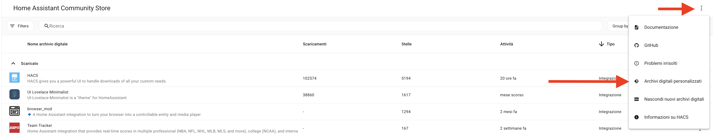
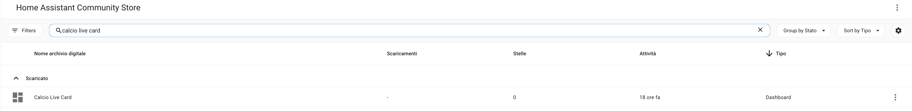

# ⚽ Calcio Live Card

> Card calcistiche per Home Assistant: belle, animate, multilingua.
> Frontend complementare all'integrazione [Calcio Live](https://github.com/Bobsilvio/calcio-live).

🇮🇹 Versione italiana (sei qui) · 🇬🇧 **[English version](README.md)**

### 🎬 [👉 Anteprima live — prova tutte le 7 card nel browser](https://bobsilvio.github.io/calcio-live-card/preview.html)

Dati reali ESPN, toggle lingua (EN/IT/FR/ES), nessuna installazione necessaria.

[](https://ko-fi.com/silviosmart)

---

## ✨ Cosa contiene

Un set di **7 card Lovelace** per Home Assistant che trasformano i sensori [Calcio Live](https://github.com/Bobsilvio/calcio-live) in una dashboard calcistica curata e moderna:

| Card | Tipo | Mostra |
|---|---|---|
| 🏅 **Classifica** | `calcio-live-classifica` | Tabella campionato con badge ranking colorati per zona (CL/EL/Retrocessione), 1° posto con shimmer dorato animato |
| ⚽ **Squadra** | `calcio-live-team` | Singola partita: punteggio live, form pills, record stagione, capocannoniere, TV, spettatori |
| 📋 **Lista partite** | `calcio-live-matches` | Partite raggruppate per giorno con highlight live, badge FT, chip TV |
| 📰 **News** | `calcio-live-news` | Feed articoli con immagini, titoli, date relative |
| 👥 **Formazioni** | `calcio-live-lineup` | XI titolari + panchina di entrambe le squadre, modulo, numero maglia |
| ⏱ **Cronologia** | `calcio-live-timeline` | Eventi minuto per minuto (goal, cartellini, sostituzioni, intervallo) |
| 🏆 **Tabellone** | `calcio-live-bracket` | Fase a eliminazione diretta: stile lista OPPURE tabellone con coppa centrale |

### Punti di forza

- 🌍 **Multilingua** — Inglese / Italiano / Francese / Spagnolo, rilevamento automatico dalla locale di HA
- 🎨 **Design premium** — glassmorphism, gradienti, sfondo aurora, animazioni fluide
- 🔔 **Celebrazione goal** — opzionale: confetti, flash, banner "GOAL!", vibrazione mobile
- ⚡ **Aggiornamenti live** — pulse sulle partite live, toast in-card (opt-in, niente spam nel pannello notifiche di HA)
- 🏆 **Card Bracket** — 2 stili: lista pulita OPPURE tabellone con coppa + connettori SVG con frecce
- 📱 **Responsive** — funziona su dashboard mobile/tablet/desktop

---

## 🎬 Anteprima live

**👉 [https://bobsilvio.github.io/calcio-live-card/preview.html](https://bobsilvio.github.io/calcio-live-card/preview.html)**

La pagina showcase renderizza **tutte le 7 card** con **dati reali ESPN** (snapshot al momento della build). Include un **toggle lingua** (EN/IT/FR/ES) per vedere come appare ogni card in ciascuna lingua, senza installare nulla.

In alternativa puoi aprire [`preview.html`](preview.html) in locale — è completamente auto-contenuto (il bundle è incluso nell'HTML), nessuna configurazione necessaria.

---

## 📦 Installazione (HACS)

1. Aggiungi questo repository in HACS come repository **Dashboard**: `https://github.com/Bobsilvio/calcio-live-card`
   
2. Cerca **Calcio Live Card** in HACS → installa.
   
3. Riavvia Home Assistant e fai **hard-refresh** della dashboard (Ctrl+F5 / Cmd+Shift+R).

> Verifica di avere installato anche l'[integrazione Calcio Live](https://github.com/Bobsilvio/calcio-live) (≥ v2.8.1) per ricevere i dati nelle card.

---

## 🃏 Riferimento card

Tutte le card condividono due opzioni comuni:

| Opzione | Descrizione |
|---|---|
| `entity` | Il sensore Calcio Live da cui leggere. L'editor filtra automaticamente le entità compatibili. |
| `language` | Forza una lingua specifica: `auto` (default, segue locale HA), `en`, `it`, `fr`, `es`. |

### 🏅 Classifica

```yaml
type: custom:calcio-live-classifica
entity: sensor.calciolive_classifica_italian_serie_a
max_teams_visible: 12
hide_header: false
selected_group: ''
show_event_toasts: false
```

- **Badge ranking** colorati per zona di qualificazione: oro per il 1°, indaco per la Champions, arancione per l'Europa, rosso per la retrocessione.
- Il **primo posto** ha uno shimmer dorato animato.
- Header tabella sticky durante lo scroll.

### ⚽ Squadra · singola partita

```yaml
type: custom:calcio-live-team
entity: sensor.calciolive_next_serie_a_internazionale
show_event_toasts: false
```

Mostra la prossima/attuale/ultima partita di una squadra:
- Scoreboard grande con loghi delle squadre come sfondo
- Form pills (ultime 5 partite: V/N/P o W/D/L per lingua)
- Chip record stagione (`14V · 6N · 14P`)
- Chip capocannoniere con goal stagione
- Chip TV per partite future (`📺 DAZN`)
- Chip spettatori per partite finite (`👥 75.923 spettatori`)
- Barre statistiche live (possesso / tiri / in porta) durante la partita
- Click **Dettagli** apre un popup con formazioni complete + cronologia + precedenti H2H

### 📋 Lista partite

```yaml
type: custom:calcio-live-matches
entity: sensor.calciolive_all_serie_a
max_events_visible: 5
max_events_total: 50
hide_past_days: 0
show_finished_matches: true
hide_header: false
show_event_toasts: false
```

- Raggruppato per giorno: **Oggi** / **Ieri** / **Domani** / `gg MMM`
- Partite live: barra rossa di highlight + glow
- Mini chip TV sulle partite future
- Click su una riga → popup dettagli

### 📰 Card News

```yaml
type: custom:calcio-live-news
entity: sensor.calciolive_news_ita_1
max_articles: 5
hide_header: false
hide_images: false
```

Feed articoli: titolo, descrizione (max 2 righe), immagine, categoria, data relativa (`3 ore fa`). Click apre l'articolo.

### 👥 Card Formazioni

```yaml
type: custom:calcio-live-lineup
entity: sensor.calciolive_next_serie_a_internazionale
hide_header: false
```

- Due colonne (casa / ospiti) con XI titolare
- Foto giocatori (quando disponibili), numero maglia, ruolo
- Modulo tattico mostrato (es. `4-3-3`)
- Sezione panchina
- Si comprime a una colonna su mobile

> Disponibile poco prima del fischio d'inizio (quando ESPN pubblica le formazioni).

### ⏱ Card Cronologia

```yaml
type: custom:calcio-live-timeline
entity: sensor.calciolive_next_serie_a_internazionale
reverse_order: true
hide_header: false
```

Log eventi minuto per minuto:
- ⚽ goal (dot oro)
- 🟨 cartellino giallo / 🟥 cartellino rosso
- 🔄 sostituzione
- ⏸ intervallo / ▶ secondo tempo / 🏁 fine
- Ogni evento mostra minuto, giocatore, squadra, descrizione

### 🏆 Card Tabellone (Bracket)

```yaml
type: custom:calcio-live-bracket
entity: sensor.calciolive_bracket_uefa_champions
style: tree         # 'list' (default) oppure 'tree' (con coppa centrale)
hide_header: false
compact: false
tree_show_playoffs: false
```

Due stili visuali:

- **list** (default): round affiancati come colonne con tutti i dettagli (andata, ritorno, aggregato, vincitore).
- **tree**: tabellone stile torneo con **coppa al centro**, lati specchiati, mini-tie con sigle squadre, **connettori SVG con frecce** tra i round.

Il sensore bracket viene creato automaticamente dall'integrazione per le competizioni a coppa:
- UEFA Champions League / Europa League / Conference League / Euro / Nations League / Women's CL
- FIFA World Cup / Women's World Cup / Club World Cup
- CONCACAF Champions / Gold Cup / Nations League
- Coppa Italia / FA Cup / EFL Cup / Copa del Rey / DFB-Pokal / Coupe de France

---

## 🔥 Sequenza celebrazione goal

Quando attivi `show_event_toasts: true` sulla Team card, l'evento **calcio_live_goal** per quella partita scatena una sequenza multi-effetto:

1. **Flash card** — anello colorato animato attorno al bordo
2. **Burst di luce radiale** — overlay vignetta dorata
3. **Banner "GOAL!" gigante** — testo giallo pulsante con stroke (1.5s)
4. **Pop del punteggio** — scale + glow sul nuovo score
5. **Bounce del logo** — il logo della squadra che ha segnato ruota e scala
6. **Confetti** — 36 particelle (6 colori + emoji ⚽🎉✨🔥⭐)
7. **Vibrazione mobile** — `[180, 80, 180, 80, 280]` se supportata
8. **Toast banner** — scuro con bordo dorato, 4s

Tutto in-card, niente persistent notification di Home Assistant.

---

## 🌍 Multilingua

Tutte le stringhe UI sono tradotte tramite il dizionario centralizzato `i18n.js` con **75+ chiavi** in **Inglese, Italiano, Francese, Spagnolo**.

La card rileva automaticamente la lingua da `hass.locale.language` (la lingua dell'interfaccia HA). Per forzare una lingua specifica, imposta `language: en|it|fr|es` nello YAML della card oppure scegli dal dropdown nell'editor.

Esempi:
| Chiave | EN | IT | FR | ES |
|---|---|---|---|---|
| `card.bracket` | Bracket | Tabellone | Tableau | Cuadro |
| `round.r16` | Round of 16 | Ottavi di finale | Huitièmes de finale | Octavos de final |
| `time.today` | Today | Oggi | Aujourd'hui | Hoy |
| `event.yellow_card` | Yellow Card | Cartellino giallo | Carton jaune | Tarjeta amarilla |

---

## 💝 Supportami

Se ti piace il mio lavoro e vuoi che continui nello sviluppo delle card, puoi offrirmi un caffè:

[](https://www.paypal.com/donate/?hosted_button_id=Z6KY9V6BBZ4BN)
[](https://ko-fi.com/silviosmart)

Seguimi sui social:

[](https://www.tiktok.com/@silviosmartalexa)
[](https://www.instagram.com/silviosmartalexa)
[](https://www.youtube.com/@silviosmartalexa)

## 🎥 Video guida

Il video è basato sulla versione 2.0.1; dalla 2.1.0 è stata introdotta la parte grafica. Il redesign attuale e le nuove card sono documentati in questo README.

[Guarda il video su YouTube](https://www.youtube.com/watch?v=K-FAJmwsGXs)

## 📜 Licenza

ISC — vedi [LICENSE](LICENSE).

I dati sono forniti dalle API pubbliche di ESPN.
