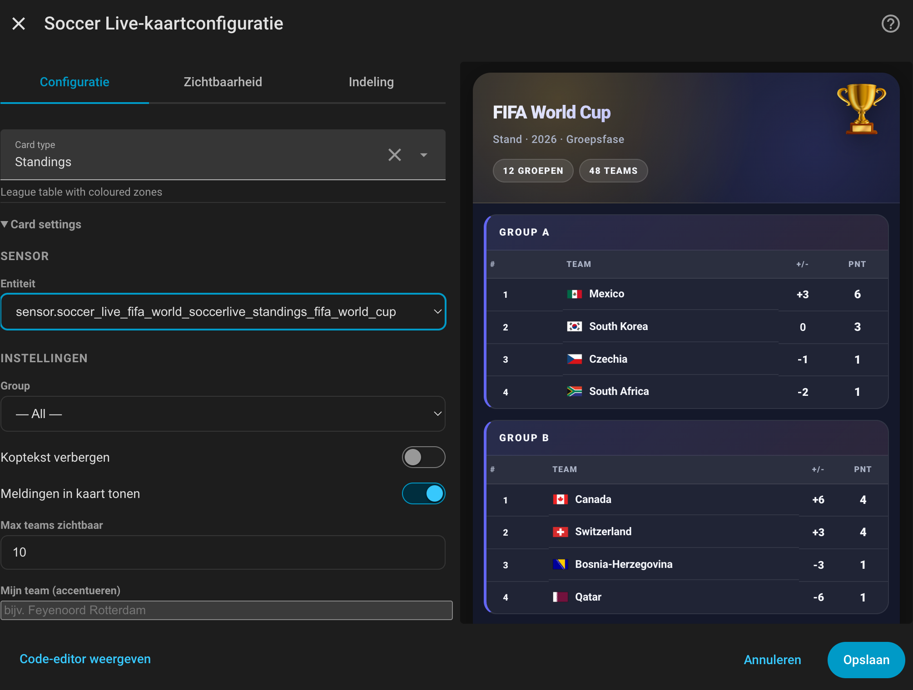
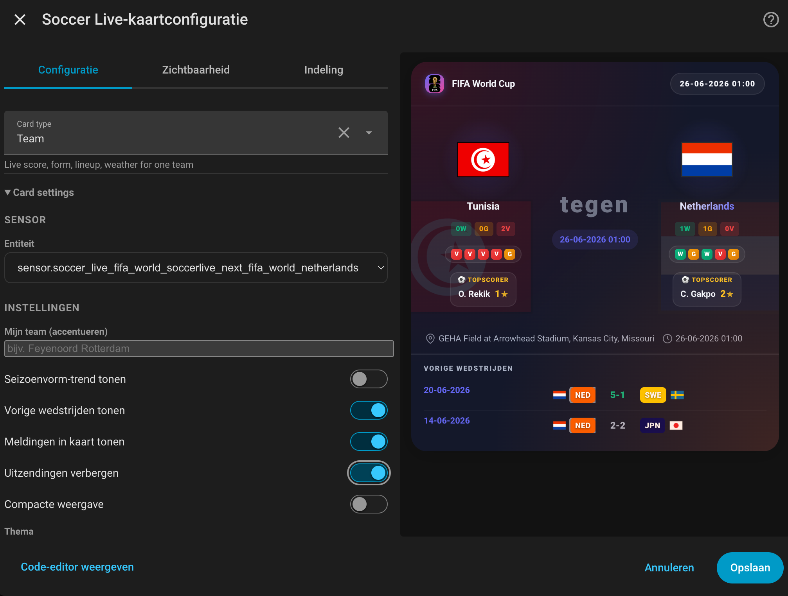
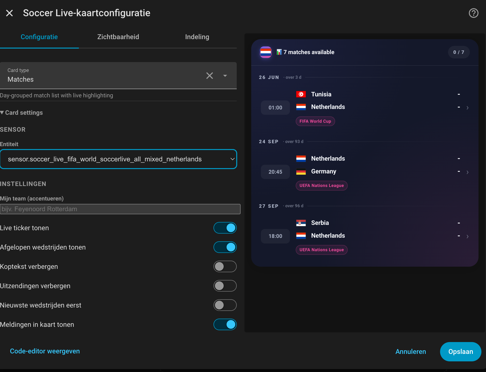
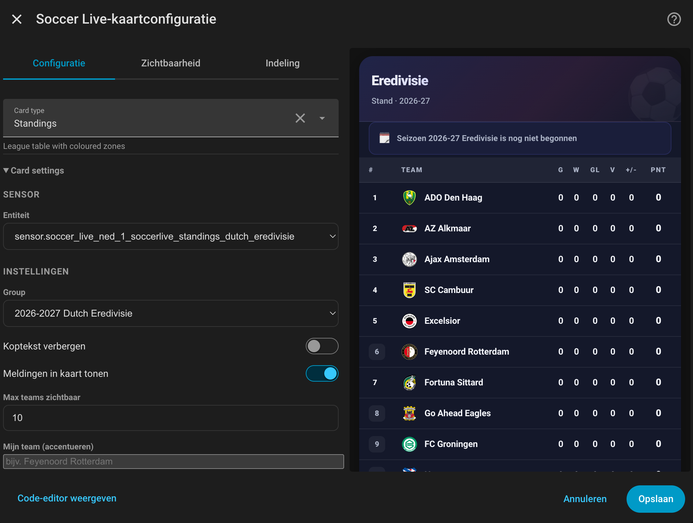
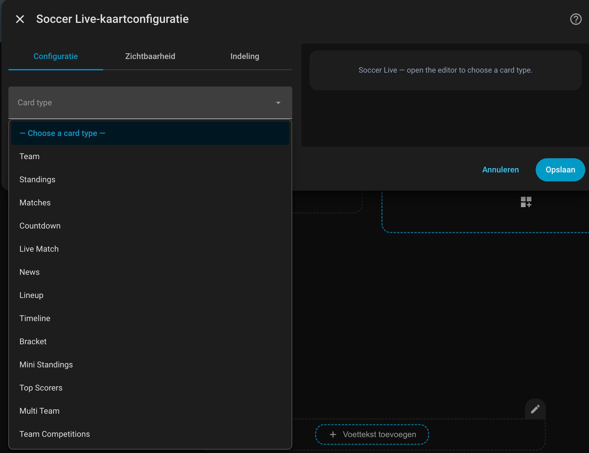

# ⚽ Soccer Live Card

Beautiful, animated football cards for Home Assistant with multi-language support, extensive customization, offline caching, and mobile responsiveness.

Companion for the [Soccer Live integration](https://github.com/rononline/soccerlive).

**[Live preview →](https://rononline.github.io)** — all cards rendered with mock data, no Home Assistant needed.

> Built on ideas from [Calcio Live Card](https://github.com/Bobsilvio/calcio-live-card) by @Bobsilvio

---

## ✨ Cards

All cards share the same wrapper — add one **Soccer Live Card** via the HA picker, then choose the type in the editor.

| Card | `card_type` | Description |
|---|---|---|
| Standings | `standings` | League table with coloured zones (CL / EL / relegation), gold for #1 |
| Team | `team` | Live score, form pills, season record, top scorer, TV channel, attendance, weather, upcoming + previous matches |
| Matches | `matches` | Day-grouped matches with live highlighting and FT badge |
| News | `news` | Article feed with images and relative timestamps |
| Bracket | `bracket` | Knockout bracket: collapsible list view or tournament tree with trophy and champion banner |
| Top Scorers | `scorers` | Top scorers list with photo, team logo and goal tally |
| Countdown | `countdown` | Countdown timer to next match; compact strip when live/finished, optional hide |
| Mini Standings | `mini-standings` | Compact standings table with configurable rows, groups, zone-colour indicators and team highlight |
| Multi Team | `multi-team` | Multiple teams' matches in one card |
| Team Competitions | `team-competitions` | All team competitions with tab selector |
| Match Center | `match-center` | Tabbed match view: Overview (with form strips), Stats, Timeline (filterable), Lineup (pitch view), H2H |
| Team Form | `team-form` | Form trend with W/D/L dots, goals chart, home/away split, match list |
| Lineup | `lineup` | Starting eleven for both teams on a pitch, with bench |
| Timeline | `timeline` | Minute-by-minute match events |
| Diagnostics | `diagnostics` | Sensor health, update status, API state and match counters |
| Ticker | `ticker` | Horizontal scrollable strip of today's matches (live scores, upcoming times, FT results) |

> **Legacy YAML** (old individual types like `custom:soccer-live-team`) still work for backward compatibility.

### Features

- 🌍 **Multi-language** — EN / NL / DE / PT / FR / ES / IT, auto-detected via HA locale
- 🎨 **Animations** — live pulse, score pop, goal confetti + banner
- 🔔 **In-card toasts** — optional on goals and cards, no notification spam
- 🏆 **Bracket** — list style (collapsible rounds with progress counter) or tournament tree with SVG connector lines, group stage tab and team highlight
- 🎨 **Themes** — `dark`, `light`, `auto`, `custom`, `red-white`, `red-gold`, `blue-red`, `white-gold`, `classic`, `neon`, `gold`, `orange`, `blue`, `black-white`
- 📱 **Responsive** — works on mobile, tablet and desktop
- 📡 **Offline caching** — last-known data shown when integration is unavailable
- 🌦️ **Weather** — current conditions at the match venue (Team, Countdown and Match Center cards)

---

## 📸 Screenshots

| Standings (tournament) | Team | Matches |
|---|---|---|
|  |  |  |

| Standings (league) | Visual editor |
|---|---|
|  |  |

---

## 📦 Installation via HACS

> **HACS default store**: submission pending — once approved, search for **Soccer Live Card** directly in HACS.

Until then, add as a **custom repository**:
1. In HACS → ⋮ → **Custom repositories** → add `https://github.com/rononline/soccerlive-card`, category: **Dashboard**
2. Install **Soccer Live Card** via HACS
3. Restart Home Assistant and do a hard refresh of the dashboard (`Ctrl+F5` / `Cmd+Shift+R`)

> Make sure the [Soccer Live integration](https://github.com/rononline/soccerlive) is installed first.

Example dashboards are available in [`examples/`](examples/):
`feyenoord-dashboard.yaml`, `world-cup-dashboard.yaml` and `mobile-minimal-dashboard.yaml`.

For local styling work and screenshots, run `npm run preview` and open
`http://localhost:4173/docs/preview.html`. It renders all card types with
fixture data, edge cases and skin/language selectors without requiring Home Assistant.

Run `npm run smoke:preview` to verify that the preview fixture and built bundle
are present before releasing.

---

## 🃏 Card reference

All cards share these common options:

| Option | Default | Description |
|---|---|---|
| `entity` | required | The Soccer Live sensor entity ID |
| `language` | `auto` | Force language: `auto`, `en`, `nl`, `de`, `pt`, `fr`, `es`, `it` |
| `skin` | `dark` | `dark`, `light`, `auto`, `custom`, `red-white`, `red-gold`, `blue-red`, `white-gold`, `classic`, `neon`, `gold`, `orange`, `blue`, `black-white` |
| `hide_header` | `false` | Hide the top bar with competition logo and name |
| `hide_broadcasts` | `false` | Hide TV/streaming channel chips (ESPN data is US-centric) — applies to Team, Countdown, MatchCenter, Matches |
| `compact` | `false` | Dense layout: smaller scoreboard, hides form strips and H2H — applies to Team and Countdown |

Legacy skin names still work: `feyenoord` maps to `red-white`, `arsenal` to `red-gold`, `barcelona` to `blue-red`, and `real-madrid` to `white-gold`.

Custom skins support these optional color keys: `accent_color`, `accent_2_color`, `background_color`, `surface_color`, `card_color`, `text_color`, `secondary_text_color`, `divider_color`, `chip_color`, `chip_border_color`, `live_color`, `gold_color`.

```yaml
type: custom:soccer-live-card
card_type: team
entity: sensor.soccer_live_next_ned_1_feyenoord_rotterdam
skin: custom
accent_color: "#ff6b00"
accent_2_color: "#2563eb"
background_color: "#090909"
```

`skin: auto` uses team colors from the selected Soccer Live sensor when available (`team_colors`, `home_color`, `away_color`, `next_match`, or the first match in `matches`). You can still provide `team_colors`, `team_color`, `home_color` or `away_color` in YAML as fallback inputs.

The visual editor shows sensor-type hints and warnings for the selected card type, and card-specific settings are grouped in a collapsible section.

> **Entity IDs:** Examples in this README use simplified IDs like `sensor.soccer_live_standings_ned_1`. Your actual entity IDs may be longer (e.g. `sensor.soccer_live_ned_1_soccerlive_standings_dutch_eredivisie`). Use the visual editor to pick the correct sensor.

### 🏅 Standings

```yaml
type: custom:soccer-live-card
card_type: standings
entity: sensor.soccer_live_standings_ned_1
max_teams_visible: 18
hide_header: false
show_event_toasts: false
```

### ⚽ Team

```yaml
type: custom:soccer-live-card
card_type: team
entity: sensor.soccer_live_next_ned_1_feyenoord_rotterdam
show_event_toasts: true
score_size: normal    # normal / big / huge
show_previous_matches: true
show_form_trend: true
```

With `show_event_toasts: true`, a goal triggers a full celebration:
confetti burst, flashing card border, large "GOAL!" banner, score animation and vibration on mobile.

The card shows a **weather badge** (temperature, wind) for the match venue when conditions are available.

**Upcoming matches** show a row per fixture with team badge, date and live score when in progress. The opponent's last-5 form dots appear below each row (green = win, grey = draw, red = loss). With `show_previous_matches: true`, finished matches are shown with score coloured from the tracked team's perspective and a competition label in the date column.

### 📋 Matches

```yaml
type: custom:soccer-live-card
card_type: matches
entity: sensor.soccer_live_all_ned_1
max_events_visible: 6
max_events_total: 50
show_finished_matches: true
hide_past_days: 0
show_event_toasts: false
```

### 📰 News

```yaml
type: custom:soccer-live-card
card_type: news
entity: sensor.soccer_live_news_ned_1
max_articles: 5
hide_images: false
```

### 🏆 Bracket

```yaml
type: custom:soccer-live-card
card_type: bracket
entity: sensor.soccer_live_bracket_uefa_champions
style: tree              # 'list' (default) or 'tree'
compact: false
tree_show_playoffs: false
my_team: "Ajax"          # optional: highlight path to final
groups_entity: sensor.soccer_live_standings_uefa_champions  # optional: adds Groups tab
matches_entity: sensor.soccer_live_all_uefa_champions       # optional: adds Schedule tab
```

The bracket sensor is created automatically for cup competitions:
Champions League, Europa League, Conference League, FA Cup, Copa del Rey, World Cup, Euros, and more.

**`my_team`** — case-insensitive substring match against team names. The matching tie gets a green border; all other ties are dimmed. In tree view, the bracket half containing the team is highlighted green (Path to Final) and the other half is faded. When `my_team` is set and a tie is completed, a **won/eliminated badge** (✓ Won / ✗ Eliminated) appears in the tie footer. A **"My next match" banner** above the tabs shows the next upcoming or live match involving `my_team` with logos, score/time, round and venue. The schedule tab also shows a **My team** filter chip to jump directly to that team's matches.

**`groups_entity`** — point to the standings sensor for the same competition. Adds a **Groups** tab with all groups in a compact grid, qualification rows highlighted and `my_team` marked in green.

**`matches_entity`** — point to an `all_*` sensor for the same competition. Adds a **Schedule** tab showing all matches grouped by date. Placeholder dates far in the future (ESPN data quality issue) are filtered out automatically. Dates and times respect the HA timezone setting. Day headers show the round name (e.g. Round of 16) as a chip next to the date.

**Schedule tab filter chips** — Live / Today / My team / All. Each chip shows the match count; empty chips are dimmed. The tab **auto-selects** the most relevant filter on load: Live if matches are in progress, Today if there are matches today, otherwise All. Clicking a chip overrides this. A live clock (`62'`) appears next to the score of in-progress matches.

**List view (default)** — Rounds are collapsible: click the round header to expand or collapse it. The header shows a progress counter (`3/4`, or `● 1/4` when a match is live). Clicking a mini-tie card navigates to the matching date in the Schedule tab.

**Tree view — early rounds** — For large brackets (WK 2026: 48 teams / R32 + R16), the Round of 32 and Round of 16 appear below the tree as a collapsible 2-column grid so the tree itself shows only QF → SF → Final. Completed rounds collapse automatically on load. A progress badge (`✓ 16/16` or `● 3/16` for live) is shown in the header, along with the date range of the round (e.g. `Jun 29 – Jul 4`). Pending ties show their scheduled first-leg date.

**Tree view — live clock** — When a match is in progress, the mini card in the tree shows a live dot and the current minute (e.g. `● 67'`).

**Champion banner** — Once the final is completed, a gold banner with the winner's logo appears at the top of the bracket.

WK 2026 example:
```yaml
type: custom:soccer-live-card
card_type: bracket
entity: sensor.soccer_live_bracket_fifa_world
groups_entity: sensor.soccer_live_standings_fifa_world
matches_entity: sensor.soccer_live_all_fifa_world
style: tree
my_team: Netherlands
```

### 🥇 Top Scorers

```yaml
type: custom:soccer-live-card
card_type: scorers
entity: sensor.soccer_live_scorers_ned_1
max_items: 10
hide_header: false
```

The top scorers sensor (`soccer_live_scorers_*`) is created automatically for every competition sensor.
Shows: rank, player photo, name, team logo and goal tally.

> Not all competitions provide top scorer data via ESPN. If the sensor shows `Not available`, the competition does not support this endpoint.

### ⏳ Countdown

```yaml
type: custom:soccer-live-card
card_type: countdown
entity: sensor.soccer_live_next_ned_1_feyenoord_rotterdam
hide_when_live: false        # true = card disappears when match is live or finished
competition_filter: "World Cup"  # optional: filter by competition name (case-insensitive)
compact: false               # true = hides form dots and H2H snippet
```

**`competition_filter`** — useful when pointing the countdown at a multi-competition sensor like `all_mixed`. Only matches whose `competition_name` or `league_name` contains the filter string (case-insensitive) are considered:

```yaml
type: custom:soccer-live-card
card_type: countdown
entity: sensor.soccer_live_all_mixed_netherlands
competition_filter: "World Cup"
```

Shows a countdown timer to the next match. Under each team logo, the last 5 form dots (green/grey/red) are shown, and the most recent head-to-head result appears below the countdown. When the match starts, the card collapses to a compact one-line strip showing `● LIVE · Home – Away · 2–1 62'`; when finished it shows `✓ FT · Home – Away · 1–3`. Set `hide_when_live: true` to remove the card entirely during and after the match. Also shows a **weather badge** for the match venue.

With `compact: true`, the card uses a smaller layout and hides the form dots and H2H snippet.

### 🏆 Mini Standings

```yaml
type: custom:soccer-live-card
card_type: mini-standings
entity: sensor.soccer_live_standings_ned_1
max_rows: 5
default_group: null    # optional: default standings group (e.g. "Group A")
highlight_team: null   # optional: highlight a team row (case-insensitive substring)
hide_stats: false      # optional: hide W/D/L/GD columns
```

Compact standings table sorted by points, wins and goal difference. When `highlight_team` is set, the matching row is highlighted and automatically scrolled into view on load. If the integration provides `zone_color` for a row (e.g. green for Champions League qualification, red for relegation), a coloured bar appears on the left edge of the rank cell.

### 🔄 Multi Team

```yaml
type: custom:soccer-live-card
card_type: multi-team
entities:
  - sensor.soccer_live_next_ned_1_feyenoord_rotterdam
  - sensor.soccer_live_all_mixed_ajax
  - sensor.soccer_live_all_mixed_psv_eindhoven
title: My Teams
hide_header: false
```

Shows multiple teams' matches in one compact card, each on its own row.

### 🗂️ Team Competitions

```yaml
type: custom:soccer-live-card
card_type: team-competitions
entity: sensor.soccer_live_all_mixed_feyenoord_rotterdam
team_name: "Feyenoord"      # optional: override team name
default_comp: "Eredivisie"  # optional: default competition tab
```

All team competitions in one card with a tab selector to switch between leagues and cups.

### 🗂️ Match Center

```yaml
type: custom:soccer-live-card
card_type: match-center
entity: sensor.soccer_live_next_ned_1_ajax
```

Tabbed view of a single match with five tabs:

- **Overview** — W/D/L form dots for both teams, season record, current standing, week label, venue and broadcast chips. The card automatically switches to the Timeline tab when the match kicks off (only if you haven't manually navigated away from Overview).
- **Stats** — side-by-side stat bars for possession, shots, etc. (available after kick-off).
- **Timeline** — chronological event list with filter chips: **All / ⚽ Goals / 🟨 Cards**. The filter resets to All whenever you switch tabs. The card auto-switches here when a match goes live.
- **Lineup** — both teams on a pitch rendered by formation, with bench list (available once ESPN publishes the lineup).
- **H2H** — historical head-to-head results with win/draw/loss bar.

The active tab is remembered across page refreshes (per entity, via sessionStorage).

> Works best with a `next_*` or `all_mixed_*` sensor, which enriches the match with lineup, key events and H2H via the ESPN summary endpoint. Also shows a **weather badge** for the match venue.

### 👥 Team Form

```yaml
type: custom:soccer-live-card
card_type: team-form
entity: sensor.soccer_live_next_ned_1_ajax
team_name: Ajax
```

> `team_name` is recommended. Without it the card tries to auto-detect the tracked team from `previous_matches`, but detection may be ambiguous with only one previous match or when the same opponent appears multiple times.

### 📋 Lineup

```yaml
type: custom:soccer-live-card
card_type: lineup
entity: sensor.soccer_live_next_ned_1_ajax
```

Starting eleven for both teams rendered on a football pitch with jersey-number circles positioned by formation. Includes a bench list below. Falls back to a two-column list when no formation data is available.

### ⏱️ Timeline

```yaml
type: custom:soccer-live-card
card_type: timeline
entity: sensor.soccer_live_next_ned_1_ajax
```

Minute-by-minute match events (goals, cards, substitutions, half-time, full-time) in chronological order.

### 🧪 Diagnostics

```yaml
type: custom:soccer-live-card
card_type: diagnostics
entity: sensor.soccer_live_next_ned_1_ajax
```

Shows sensor type, API status, match counters, request counters and the last successful update. Useful when checking whether missing card data is a card issue or an integration/data issue.

### 📺 Ticker

```yaml
type: custom:soccer-live-card
card_type: ticker
entity: sensor.soccer_live_all_ned_1
filter: live                  # optional: live / empty for all
competition_filter: "World Cup"  # optional: filter by competition name (case-insensitive substring)
auto_scroll: true
scroll_speed: normal          # slow / normal / fast
hide_when_empty: true         # hides the card when the filter has no matches
```

Horizontal match strip for dense dashboards. Scrolling pauses automatically when you hover over the strip. With `hide_when_empty: true`, a live-only ticker disappears when there are no live matches.

**`competition_filter`** — show only matches whose `competition_name` or `league_name` contains the filter string. Useful when the sensor covers multiple competitions (e.g. `all_mixed_*`). If no matches match the filter, the full unfiltered list is shown as fallback.

---

## 🔗 Integration version requirements

Some card features require a minimum version of the [Soccer Live integration](https://github.com/rononline/soccerlive):

| Feature | Min. integration version |
|---|---|
| Standings zone colors from ESPN (`zone_color`, `zone_label`) | v3.4.0 |
| Team standing summary below name (`home_standing_summary`) | v3.4.0 |
| Broadcast channels list (`broadcasts`) | v3.4.0 |
| Stats / Commentary / Video chips with links (`match.links`) | v3.4.1 |
| `week_number` per match (competition schedule grouping) | v3.4.2 |
| Neutral venue flag (`neutral_site`) | v3.4.0 |
| News byline, tags, premium flag | v3.4.0 |
| Season form from summary (`last_five_home/away`) | v3.4.0 |
| Countdown competition name from `league_info.name` | v3.6.5 |
| URL-based shared fetch cache (sensors on same endpoint share one request) | v3.6.3 |
| Stable `league_name` / `league_logo` per match on mixed/all sensors | v3.6.25 |
| Competition label in Team card previous/upcoming matches (`league_name` in compact objects) | v3.6.47 |
| Opponent form dots in Team card upcoming matches (`home_form`/`away_form` in compact objects) | v3.6.47 |
| Live clock in schedule summary (`clock` in compact schedule objects) | v3.6.48 |

Cards degrade gracefully when older integration versions are used — features simply won't appear if the data is absent.

---

## 🌍 Multi-language

All UI text is translated via `src/i18n.js` with **290 keys** in seven languages.

| Key | EN | NL | DE | PT | FR | ES | IT |
|---|---|---|---|---|---|---|---|
| `time.today` | Today | Vandaag | Heute | Hoje | Aujourd'hui | Hoy | Oggi |
| `event.goal` | Goal | Doelpunt | Tor | Gol | But | Gol | Goal |
| `event.cards` | Cards | Kaarten | Karten | Cartões | Cartons | Tarjetas | Cartellini |
| `filter.all` | All | Alles | Alle | Todos | Tout | Todo | Tutto |
| `round.r16` | Round of 16 | Achtste finales | Achtelfinale | Oitavas | Huitièmes | Octavos | Ottavi |
| `status.halftime` | Halftime | Rust | Halbzeit | Intervalo | Mi-temps | Descanso | Intervallo |
| `status.extra_time` | Extra Time | Verlengingen | Verlängerung | Prorrogação | Prolongations | Prórroga | Tempi supplementari |
| `status.shootout` | Penalty Shootout | Strafschoppen | Elfmeterschießen | Pênaltis | Tirs au but | Penaltis | Rigori |
| `status.end_match` | End of Match | Einde wedstrijd | Spielende | Fim da partida | Fin du match | Fin del partido | Fine partita |
| `team.form` | Form | Vorm | Form | Forma | Forme | Forma | Forma |
| `ui.loading_timeout` | Loading timeout | Laden mislukt | Ladetimeout | Tempo esgotado | Délai dépassé | Tiempo agotado | Timeout |

---

## ✅ Release checklist

For maintainers:

1. Update `package.json` version.
2. Run `npm run build`.
3. Run `npm run smoke:preview`.
4. Commit `src/`, `docs/`, `README.md`, `package*.json` and `dist/soccer-live-card.bundle.js`.
5. Push to `main`.
6. Check the GitHub Auto Release workflow and confirm the new release appears as latest.
7. In Home Assistant/HACS, refresh the browser cache after updating the frontend resource.

> Tip: batch related changes into one version bump per session rather than bumping for every small fix.

---

## 📜 License

GPL-3.0 — see [LICENSE](LICENSE).
