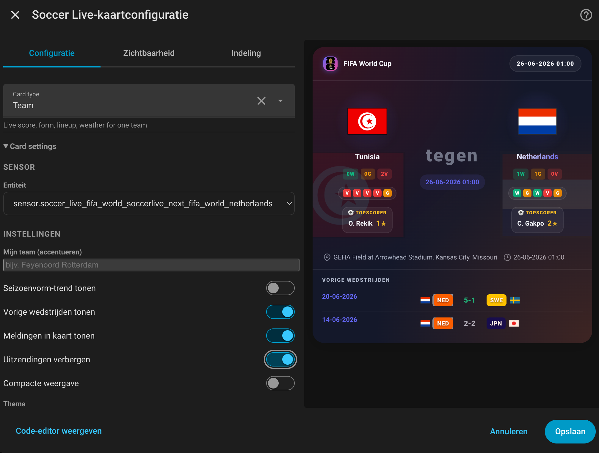
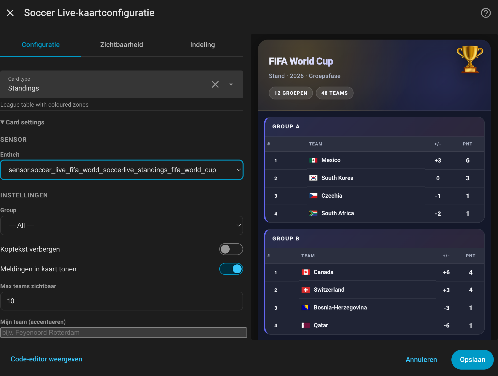
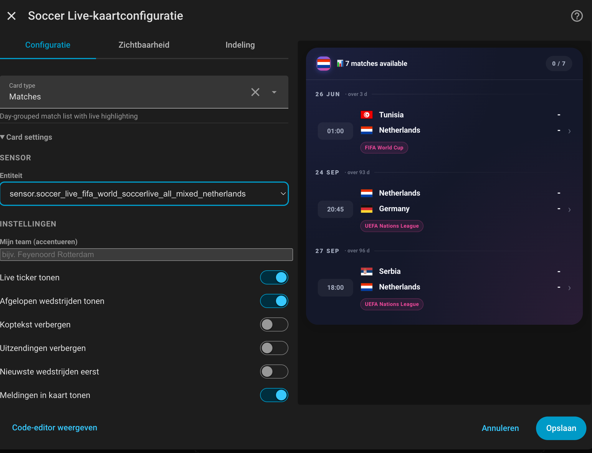
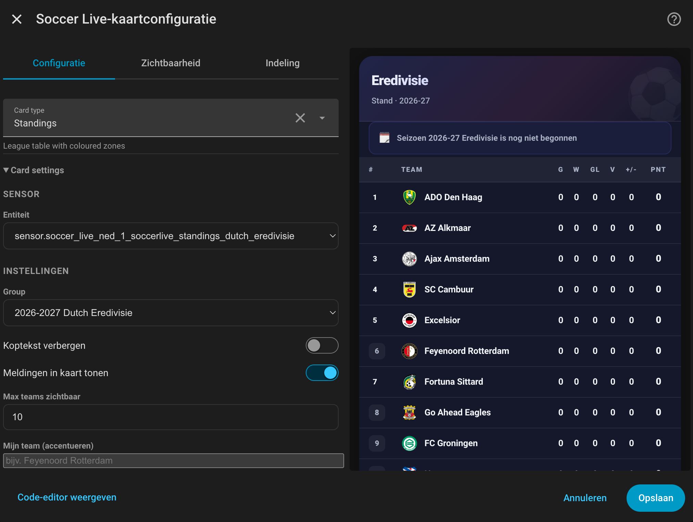
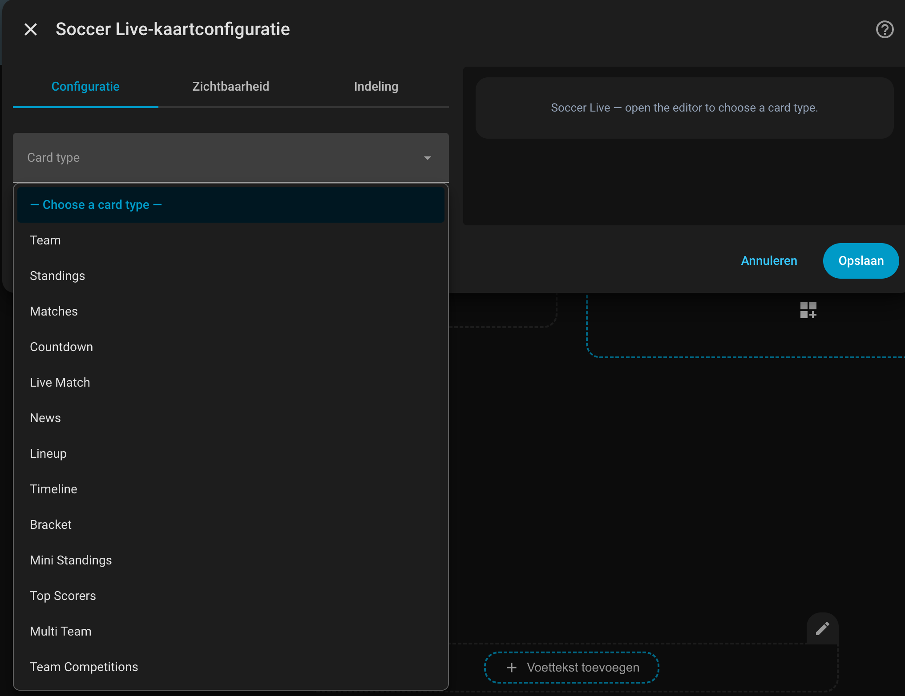

# ⚽ Soccer Live Card

Beautiful, animated football cards for Home Assistant with multi-language support, extensive customization, offline caching, mobile responsiveness, and provider-neutral Soccer Live sensor support.

Companion for the [Soccer Live integration](https://github.com/rononline/soccerlive).

**[Live preview →](https://rononline.github.io)** — all cards rendered with mock data, no Home Assistant needed.

> Built on ideas from [Calcio Live Card](https://github.com/Bobsilvio/calcio-live-card) by @Bobsilvio

---

## 🚀 Quick start

1. Install the **[Soccer Live integration](https://github.com/rononline/soccerlive)** via HACS and add it: choose **ESPN** (free, no API key) → **Team** → your league and team (for example *Eredivisie → Feyenoord*).
2. Install **Soccer Live Card** via HACS (see [Installation](#-installation-via-hacs) below).
3. On your dashboard: **Add card → Soccer Live Card**.
4. Select your team's **`next_*`** entity (`soccer_live_next_{competition}_{team}`) — that's the sensor the Team, Countdown and Match Center cards use.
5. Done — the Team card renders automatically. Switch the **card type** in the editor to explore the others.

The editor also offers six **quick profiles**: Simple, Matchday, Live,
Analysis, Club dashboard and Compact mobile. A profile chooses sensible card
settings while retaining your entity, supplementary sources, language and
appearance; the normal controls remain available afterwards.



---

## ✨ Cards

All cards share the same wrapper — add one **Soccer Live Card** via the HA picker,
then choose the type in the categorized editor. The picker offers 20 distinct
cards; the old `hub` and `race` identifiers remain supported as compatibility
aliases, so existing dashboards do not need a migration.

| Card | `card_type` | Description |
|---|---|---|
| Standings | `standings` | League table with coloured zones (CL / EL / relegation), gold for #1 |
| Team | `team` | Live score, form pills, season record, top scorer, TV channel, attendance, weather, upcoming + previous matches |
| Matches | `matches` | Filterable, day-grouped matches with smart ordering and a phase-aware detail popup |
| News | `news` | Article feed with images and relative timestamps |
| Bracket | `bracket` | Knockout bracket: collapsible list view or tournament tree with trophy and champion banner |
| Top Scorers | `scorers` | Top scorers list with photo, team logo and goal tally |
| Countdown | `countdown` | Countdown timer to next match; compact strip when live/finished, optional hide |
| Last Match | `last-match` | Most recent finished match: competition, teams, final score and goalscorers |
| Mini Standings | `mini-standings` | Compact standings table with configurable rows, groups, zone-colour indicators and team highlight |
| Multi Team | `multi-team` | Multiple teams' matches in one card |
| Team Competitions | `team-competitions` | All team competitions with tab selector |
| Match Center | `match-center` | Tabbed or phase-aware match view: Overview, Stats, Timeline, Lineup and H2H |
| Team Form | `team-form` | Form trend with W/D/L dots, goals chart, home/away split, match list |
| Club | `club` | Matchday dashboard, club profile, squad analysis, injuries, market values, team news and transfers |
| Lineup | `lineup` | Starting eleven for both teams on a pitch, with bench |
| Timeline | `timeline` | Minute-by-minute match events |
| Diagnostics | `diagnostics` | Setup/sensor health, update status, API state, source conflicts, blending and match counters |
| Matchday | `matchday` | Focused matchday with counters, data completeness and pre-match readiness |
| Archive | `archive` | Filterable local history with season statistics, streaks and backup controls |
| Ticker | `ticker` | Horizontal scrollable strip of today's matches (live scores, upcoming times, FT results) |
| Minimal | `minimal` | Minimal text views for fixtures, next match, standings or form (`schedule` remains an alias) |

The Standings editor also offers a **competition race** view with remaining
fixtures, projections, result scenarios and position history. Match Center has
a **phase-aware** mode that follows preview, live play and review automatically.

> **Legacy YAML** (old individual types like `custom:soccer-live-team`, plus
> `card_type: hub` and `card_type: race`) still works for backward compatibility.

### Features

- 🌍 **Multi-language** — EN / NL / DE / PT / FR / ES / IT, auto-detected via HA locale
- 🎨 **Animations** — live pulse, score pop, goal confetti + banner
- 🔔 **In-card toasts** — optional on goals and cards; provider-neutral
  `event_uid` values suppress duplicate toasts when overlapping sources report
  the same incident, and score corrections render as a translated VAR-style
  rollback
- 🏆 **Bracket** — list style (collapsible rounds with progress counter) or tournament tree with SVG connector lines, group stage tab and team highlight
- 🎨 **Themes** — `dark`, `light`, `auto`, `custom`, `red-white`, `red-gold`, `blue-red`, `white-gold`, `classic`, `neon`, `gold`, `orange`, `blue`, `black-white`
- 📱 **Responsive** — works on mobile, tablet and desktop
- 📡 **Offline caching** — last-known data shown when integration is unavailable
- 🌦️ **Weather** — venue conditions on Team, Countdown, Match Center and enriched Matches details; upcoming matches use the kickoff forecast when available
- 🔮 **Match preview** (API-Football, Team card) — for upcoming matches: win-probability prediction + advice, averaged 1X2 odds, and injured/suspended players — each shown only when data exists
- 📊 **xG** — expected goals in the live stats row when the provider supplies it
- 🧩 **Capability-based enrichment** — richer blocks appear when a sensor supplies the required attributes; cards remain usable with standard Soccer Live data
- 🔀 **Optional source blending** — select a supplementary sensor, or let the card find the richest overlapping provider, while the primary schedule remains authoritative
- ✅ **Match readiness** — provider-neutral pre-match coverage for kick-off, venue, broadcast, weather, H2H, prediction, odds, absences and lineup
- 🗃️ **Season archive** — season, competition, opponent, result and home/away filters; trends, comparisons, import/export and optional external history
- ⚡ **Lazy editor execution** — card elements remain immediately available for legacy direct YAML, while editors load only when opened; HACS still installs one bundle
- 🏟️ **Phase-aware match details** — preview, live and review content can include form, standings, H2H, lineups, statistics, predictions, absentees and a derived match story
- 📈 **Schema-v10 match analysis** — observed preview factors, five-minute event momentum and factual post-match turning points appear only when the sensor supplies enough real data
- 👥 **Club dashboard** — optional records, selection analysis, availability, expected/official lineup, team news, player profiles, injuries, market values and transfer windows
- ♿ **Accessible interaction** — translated controls, keyboard-operable rows and modal semantics for interactive Club details
- 🧭 **Keyboard & motion preferences** — Match Center tabs support arrow/Home/End navigation, match rows open with Enter/Space, focus is visible and reduced-motion preferences disable decorative animation
- 🩺 **Actionable data alerts** — Match Center and Diagnostics explain stale live data, provider errors, conflicting sources and fixture changes when schema v5 data is available
- 🏁 **Competition race** — actual schedule context, projections, virtual table impact and position history with schema-v7 standings data
- 🧭 **Schema-v8 insights** — source capability reasons, season rollover state, structured post-match summaries and mathematical title/Europe/relegation milestones
- 🪶 **Schema-v9 on-demand details** — compatible sensors fetch a fixture's heavy timeline, statistics and lineup sections only when you open it; standalone and third-party sensors keep their existing behavior
- 🧠 **Schema-v10 diagnostics** — Setup checklist, shared refresh-cycle counters and a phase-aware optional-request plan explain first-install and quota behavior

---

## 📸 Screenshots

| Standings (tournament) | Team | Matches |
|---|---|---|
|  |  |  |

| Standings (league) | Visual editor |
|---|---|
|  |  |

---

## 📦 Installation via HACS

> **HACS default store**: submission pending — once approved, search for **Soccer Live Card** directly in HACS.

Until then, add as a **custom repository**:
1. In HACS → ⋮ → **Custom repositories** → add `https://github.com/rononline/soccerlive-card`, category: **Dashboard**
2. Install **Soccer Live Card** via HACS
3. Restart Home Assistant and do a hard refresh of the dashboard (`Ctrl+F5` / `Cmd+Shift+R`)

> Make sure the [Soccer Live integration](https://github.com/rononline/soccerlive) is installed first.

Example dashboards are available in [`examples/`](examples/):
`feyenoord-dashboard.yaml`, `world-cup-dashboard.yaml` and `mobile-minimal-dashboard.yaml`.

For local styling work and screenshots, run `npm run preview` and open
`http://localhost:4173/docs/preview.html`. It renders all card types with
fixture data, edge cases and skin/language selectors without requiring Home Assistant.

Run `npm run smoke:preview` to verify that the preview fixture and built bundle
are present before releasing.

---

## 🃏 Card reference

All cards share these common options:

| Option | Default | Description |
|---|---|---|
| `entity` | required | The Soccer Live sensor entity ID |
| `enrichment_entity` | empty | Optional supplementary sensor. It only fills missing fields on matching fixtures and never appends secondary-only schedule rows. |
| `language` | `auto` | Force language: `auto`, `en`, `nl`, `de`, `pt`, `fr`, `es`, `it` |
| `appearance` | `dark` | Structural appearance: `dark`, `light` or Home Assistant theme (`ha`) |
| `palette` | appearance-dependent | `purple`, `red-white`, `red-gold`, `blue-red`, `white-gold`, `classic`, `neon`, `gold`, `orange`, `blue`, `black-white`, `team` or `custom` |
| `hide_header` | `false` | Hide the top bar with competition logo and name |
| `hide_broadcasts` | `false` | Hide TV/streaming channel chips (ESPN data is US-centric) — applies to Team, Countdown, MatchCenter, Matches |
| `compact` | `false` | Dense layout: smaller scoreboard, hides form strips and H2H — applies to Team and Countdown |

The old single `skin` field remains supported. For example, `skin: auto` maps
to dark appearance + team palette and `skin: light` maps to light + blue.
Legacy club names also work: `feyenoord` maps to `red-white`, `arsenal` to
`red-gold`, `barcelona` to `blue-red`, and `real-madrid` to `white-gold`.

Custom skins support these optional color keys: `accent_color`, `accent_2_color`, `background_color`, `surface_color`, `card_color`, `text_color`, `secondary_text_color`, `divider_color`, `chip_color`, `chip_border_color`, `live_color`, `gold_color`.

```yaml
type: custom:soccer-live-card
card_type: team
entity: sensor.soccer_live_next_ned_1_feyenoord_rotterdam
appearance: dark
palette: custom
accent_color: "#ff6b00"
accent_2_color: "#2563eb"
background_color: "#090909"
gradient_from: "#111827"
gradient_to: "#25113d"
gradient_angle: 135
background_image: /local/feyenoord.png
watermark_opacity: 0.07
watermark_size: 60%
```

`palette: team` uses team colors from the selected Soccer Live sensor when
available (`team_colors`, `home_color`, `away_color`, `next_match`, or the
first match in `matches`). You can still provide `team_colors`, `team_color`,
`home_color` or `away_color` in YAML as fallback inputs.

The custom palette supports a validated gradient and optional watermark.
`background_image` accepts an HTTP(S) URL, image data URL or Home Assistant
`/local/…` path; opacity is clamped to `0–1`, angle to a valid CSS angle and
watermark size to safe percentage/pixel/contain/cover values.

The visual editor shows sensor-type hints and warnings for the selected card type, and card-specific settings are grouped in a collapsible section.

> **Entity IDs:** Examples in this README use simplified IDs like `sensor.soccer_live_standings_ned_1`. Your actual entity IDs may be longer (e.g. `sensor.soccer_live_ned_1_soccerlive_standings_dutch_eredivisie`). Use the visual editor to pick the correct sensor.

### 🏅 Standings

```yaml
type: custom:soccer-live-card
card_type: standings
entity: sensor.soccer_live_standings_ned_1
max_teams_visible: 18
hide_header: false
show_event_toasts: false
```

### ⚽ Team

```yaml
type: custom:soccer-live-card
card_type: team
entity: sensor.soccer_live_next_ned_1_feyenoord_rotterdam
show_event_toasts: true
score_size: normal    # normal / big / huge
show_previous_matches: true
show_form_trend: true
show_weather: true      # weather badge (default on)
show_prediction: true   # win-probability prediction (default on)
show_odds: true         # 1X2 odds (default on)
show_injuries: true     # injured/suspended players (default on)
```

With `show_event_toasts: true`, a goal triggers a full celebration:
confetti burst, flashing card border, large "GOAL!" banner, score animation and vibration on mobile.

The card shows a **weather badge** (temperature, wind) for the match venue. For an upcoming match it shows the **forecast for kickoff time**; for live/finished matches it shows current conditions.

For **upcoming matches**, when the API-Football provider supplies the data, the card also shows a **prediction** (home/draw/away win-probability bar + betting advice), averaged **1X2 odds**, and an **"Unavailable"** list of injured (🩹) and suspended (🚫) players. Each section appears only when real data exists (predictions/injuries/odds populate close to competitive matches, not friendlies) and can be turned off with `show_prediction`, `show_odds`, `show_injuries` and `show_weather` (all default on). During a match, **xG** (expected goals) appears in the stats row when available.

**Upcoming matches** show a row per fixture with team badge, date and live score when in progress. The opponent's last-5 form dots appear below each row (green = win, grey = draw, red = loss). With `show_previous_matches: true`, finished matches are shown with score coloured from the tracked team's perspective and a competition label in the date column.

### 📋 Matches

```yaml
type: custom:soccer-live-card
card_type: matches
entity: sensor.soccer_live_all_ned_1
max_events_visible: 6
max_events_total: 50
show_finished_matches: true
hide_past_days: 0
smart_order: true
filter_competition: ""
filter_season: ""
filter_state: ""       # in / pre / post
filter_venue: ""       # home / away
show_event_toasts: false
```

`smart_order: true` puts live matches first, upcoming matches oldest-first and
finished matches newest-first. It is especially useful with mixed competitions
or multiple seasons. The visual editor can also filter by competition, season,
phase and home/away venue.

Clicking a match opens a capability-based detail popup. Before kick-off it can
show kickoff countdown, competition and round, venue, broadcasts, weather,
recent form, standings, team averages, H2H, prediction, odds, absentees and an
expected lineup. During and after the match it can add official lineups,
statistics, timeline events, scorers, xG, standout statistics, player of the
match and a compact match story. Missing blocks are omitted instead of rendered
as empty placeholders.
Match Center and the Matches popup can also show which provider supplied each
section, how fresh it is, and a compact score/comeback/xG/attempts narrative.
With schema v10 they prefer the integration's observed preview factors,
five-minute momentum buckets and chronological post-match milestones. These
blocks are optional, so older and standalone sensors keep the same card layout.

### 📰 News

```yaml
type: custom:soccer-live-card
card_type: news
entity: sensor.soccer_live_news_ned_1
max_articles: 5
hide_images: false
```

### 🏆 Bracket

```yaml
type: custom:soccer-live-card
card_type: bracket
entity: sensor.soccer_live_bracket_uefa_champions
style: tree              # 'list' (default) or 'tree'
compact: false
tree_show_playoffs: false
my_team: "Ajax"          # optional: highlight path to final
groups_entity: sensor.soccer_live_standings_uefa_champions  # optional: adds Groups tab
matches_entity: sensor.soccer_live_all_uefa_champions       # optional: adds Schedule tab
```

The bracket sensor is created automatically for cup competitions:
Champions League, Europa League, Conference League, FA Cup, Copa del Rey, World Cup, Euros, and more.

**`my_team`** — case-insensitive substring match against team names. The matching tie gets a green border; all other ties are dimmed. In tree view, the bracket half containing the team is highlighted green (Path to Final) and the other half is faded. When `my_team` is set and a tie is completed, a **won/eliminated badge** (✓ Won / ✗ Eliminated) appears in the tie footer. A **"My next match" banner** above the tabs shows the next upcoming or live match involving `my_team` with logos, score/time, round and venue. The schedule tab also shows a **My team** filter chip to jump directly to that team's matches.

**`groups_entity`** — point to the standings sensor for the same competition. Adds a **Groups** tab with all groups in a compact grid, qualification rows highlighted and `my_team` marked in green.

**`matches_entity`** — point to an `all_*` sensor for the same competition. Adds a **Schedule** tab showing all matches grouped by date. Placeholder dates far in the future (ESPN data quality issue) are filtered out automatically. Dates and times respect the HA timezone setting. Day headers show the round name (e.g. Round of 16) as a chip next to the date.

**Schedule tab filter chips** — Live / Today / My team / All. Each chip shows the match count; empty chips are dimmed. The tab **auto-selects** the most relevant filter on load: Live if matches are in progress, Today if there are matches today, otherwise All. Clicking a chip overrides this. A live clock (`62'`) appears next to the score of in-progress matches.

**List view (default)** — Rounds are collapsible: click the round header to expand or collapse it. The header shows a progress counter (`3/4`, or `● 1/4` when a match is live). Clicking a mini-tie card navigates to the matching date in the Schedule tab.

**Tree view — early rounds** — For large brackets (WK 2026: 48 teams / R32 + R16), the Round of 32 and Round of 16 appear below the tree as a collapsible 2-column grid so the tree itself shows only QF → SF → Final. Completed rounds collapse automatically on load. A progress badge (`✓ 16/16` or `● 3/16` for live) is shown in the header, along with the date range of the round (e.g. `Jun 29 – Jul 4`). Pending ties show their scheduled first-leg date.

**Tree view — live clock** — When a match is in progress, the mini card in the tree shows a live dot and the current minute (e.g. `● 67'`).

**Champion banner** — Once the final is completed, a gold banner with the winner's logo appears at the top of the bracket.

WK 2026 example:
```yaml
type: custom:soccer-live-card
card_type: bracket
entity: sensor.soccer_live_bracket_fifa_world
groups_entity: sensor.soccer_live_standings_fifa_world
matches_entity: sensor.soccer_live_all_fifa_world
style: tree
my_team: Netherlands
```

### 🥇 Top Scorers

```yaml
type: custom:soccer-live-card
card_type: scorers
entity: sensor.soccer_live_scorers_ned_1
max_items: 10
hide_header: false
```

The top scorers sensor (`soccer_live_scorers_*`) is created automatically for every competition sensor.
Shows: rank, player photo, name, team logo and goal tally.

> Not all competitions provide top scorer data via ESPN. If the sensor shows `Not available`, the competition does not support this endpoint.

### ⏳ Countdown

```yaml
type: custom:soccer-live-card
card_type: countdown
entity: sensor.soccer_live_next_ned_1_feyenoord_rotterdam
hide_when_live: false        # true = card disappears when match is live or finished
competition_filter: "World Cup"  # optional: filter by competition name (case-insensitive)
compact: false               # true = hides form dots and H2H snippet
```

**`competition_filter`** — useful when pointing the countdown at a multi-competition sensor like `all_mixed`. Only matches whose `competition_name` or `league_name` contains the filter string (case-insensitive) are considered:

```yaml
type: custom:soccer-live-card
card_type: countdown
entity: sensor.soccer_live_all_mixed_netherlands
competition_filter: "World Cup"
```

Shows a countdown timer to the next match. Under each team logo, the last 5 form dots (green/grey/red) are shown, and the most recent head-to-head result appears below the countdown. When the match starts, the card collapses to a compact one-line strip showing `● LIVE · Home – Away · 2–1 62'`; when finished it shows `✓ FT · Home – Away · 1–3`. Set `hide_when_live: true` to remove the card entirely during and after the match. Also shows a **weather badge** for the match venue.

With `compact: true`, the card uses a smaller layout and hides the form dots and H2H snippet.

### 🏁 Last Match

```yaml
type: custom:soccer-live-card
card_type: last-match
entity: sensor.soccer_live_next_ned_1_feyenoord_rotterdam
```

Shows the team's **most recent finished match** at a glance: competition (with logo), both teams, the final score with the winner emphasised, the date and the goalscorers. It reads the same `team_match` sensor as the Team card — it prefers the just-finished match while the integration still keeps its full detail (so scorers appear), and otherwise falls back to the compact `previous_matches` history (score and teams, without scorers). Useful as a small companion to the Countdown/Team card so a result stays visible after the match rolls out of the "next match" slot.

### 🏆 Mini Standings

```yaml
type: custom:soccer-live-card
card_type: mini-standings
entity: sensor.soccer_live_standings_ned_1
max_rows: 5
default_group: null    # optional: default standings group (e.g. "Group A")
highlight_team: null   # optional: highlight a team row (case-insensitive substring)
hide_stats: false      # optional: hide W/D/L/GD columns
```

Compact standings table sorted by points, wins and goal difference. When `highlight_team` is set, the matching row is highlighted and automatically scrolled into view on load. If the integration provides `zone_color` for a row (e.g. green for Champions League qualification, red for relegation), a coloured bar appears on the left edge of the rank cell.

### 🔄 Multi Team

```yaml
type: custom:soccer-live-card
card_type: multi-team
entities:
  - sensor.soccer_live_next_ned_1_feyenoord_rotterdam
  - sensor.soccer_live_all_mixed_ajax
  - sensor.soccer_live_all_mixed_psv_eindhoven
title: My Teams
hide_header: false
```

Shows multiple teams' matches in one compact card, each on its own row.

### 🗂️ Team Competitions

```yaml
type: custom:soccer-live-card
card_type: team-competitions
entity: sensor.soccer_live_all_mixed_feyenoord_rotterdam
team_name: "Feyenoord"      # optional: override team name
default_comp: "Eredivisie"  # optional: default competition tab
```

All team competitions in one card with a tab selector to switch between leagues and cups.

### 🗂️ Match Center

```yaml
type: custom:soccer-live-card
card_type: match-center
entity: sensor.soccer_live_next_ned_1_ajax
phase_aware: true  # optional: automatically follow preview, live play and review
```

Tabbed view of a single match with five tabs:

- **Overview** — W/D/L form dots for both teams, season record, current standing, week label, venue and broadcast chips. The card automatically switches to the Timeline tab when the match kicks off (only if you haven't manually navigated away from Overview).
- **Stats** — side-by-side stat bars for possession, shots, etc. (available after kick-off).
- **Timeline** — chronological event list with filter chips: **All / ⚽ Goals / 🟨 Cards**. The filter resets to All whenever you switch tabs. The card auto-switches here when a match goes live.
- **Lineup** — both teams on a pitch rendered by formation, with bench list (available once ESPN publishes the lineup).
- **H2H** — historical head-to-head results with win/draw/loss bar.

The active tab is remembered across page refreshes (per entity, via sessionStorage).
Tabs follow the ARIA tabs pattern and can be navigated with Left/Right,
Home and End. The selected fixture's integration-level data alerts appear at
the top of Overview only when there is something actionable to report.

Enable `phase_aware: true` for the former Match Hub behaviour. It opens the
preview before kick-off, follows the timeline while the match is live, and
returns to the overview/review after full time. Manual tab selection remains
possible. Existing `card_type: hub` YAML continues to resolve to this mode.
Set `archive_entity` to add long-term historical meetings to H2H and
`standings_entity` to show the virtual table impact of the current score. When
the latter is omitted, the card tries to match a standings sensor by league.

The Overview tab is phase-aware: before kick-off it can show preview context;
after full time it can compare the prediction with the result and show optional
xG and match-story highlights. These blocks appear only when the sensor
provides sufficient data.
During live play the Stats tab can also show a shared five-minute momentum chart
derived from supplied attacking events. The review can name an observed turning
point without guessing when the event stream is incomplete.

> Works best with a `next_*` or `all_mixed_*` sensor. ESPN sensors enrich the match through the ESPN summary endpoint; API-Football sensors expose fixture events, statistics and lineups when summary enrichment is enabled in the integration. Also shows a **weather badge** for the match venue.

### 👥 Team Form

```yaml
type: custom:soccer-live-card
card_type: team-form
entity: sensor.soccer_live_next_ned_1_ajax
team_name: Ajax
```

> `team_name` is recommended. Without it the card tries to auto-detect the tracked team from `previous_matches`, but detection may be ambiguous with only one previous match or when the same opponent appears multiple times.

### 🏟️ Club

```yaml
type: custom:soccer-live-card
card_type: club
entity: sensor.soccer_live_club_feyenoord
skin: auto
show_matchday: true
show_season_progress: true
show_squad: true
show_squad_analysis: true
show_injuries: true
show_availability: true
show_prediction: true
show_selection: true
show_team_news: true
show_club_records: true
show_transfers: true
show_data_quality: true
show_automations: false
collapse_sections: true
dashboard_mode: false
max_transfers: 12
```

The Club card is capability-based. With only basic club data it shows the
profile, coach, squad and transfers. Additional attributes can enable:

- a phase-aware matchday panel with preview/live/review status;
- season progress, streaks, home/away points and biggest win;
- squad search, position/availability filters and market-value analysis;
- an injury centre, availability radar and unavailable-selection impact;
- expected and official lineups, with outgoing players excluded from predictions;
- team news built from injuries, recoveries, transfers and club-change events;
- player profiles with recent ratings and accessible transfer/player dialogs;
- transfer totals, windows, loan/free-transfer counts and detail popups;
- optional Home Assistant automation examples.

Every section can be disabled in the editor. Empty or unsupported sections are
hidden automatically, so a regular Soccer Live sensor still renders cleanly.
`dashboard_mode: true` selects a shorter overview. The editor also lets you
reorder sections; the resulting `section_order` array can be reused in YAML.

Example:

```yaml
section_order:
  - matchday
  - changes
  - injuries
  - squad
  - transfers
```

### 📋 Lineup

```yaml
type: custom:soccer-live-card
card_type: lineup
entity: sensor.soccer_live_next_ned_1_ajax
```

Starting eleven for both teams rendered on a football pitch with jersey-number circles positioned by formation. Includes a bench list below. Falls back to a two-column list when no formation data is available.

### ⏱️ Timeline

```yaml
type: custom:soccer-live-card
card_type: timeline
entity: sensor.soccer_live_next_ned_1_ajax
```

Minute-by-minute match events (goals, cards, substitutions, half-time, full-time) in chronological order.

### ✨ Minimal

```yaml
type: custom:soccer-live-card
card_type: minimal
entity: sensor.soccer_live_all_mixed_feyenoord
variant: fixtures       # fixtures / next / standings / form
show: upcoming          # upcoming / previous / all (fixtures only)
max_matches: 8
```

Minimal provides compact text-first views for dashboards where the full visual
cards are too large. The legacy `card_type: schedule` alias still resolves to
this card.

### 🧪 Diagnostics

```yaml
type: custom:soccer-live-card
card_type: diagnostics
entity: sensor.soccer_live_next_ned_1_ajax
```

Shows sensor type, API status, match counters, request counters and the last successful update. Useful when checking whether missing card data is a card issue or an integration/data issue.
With schema v8 it also shows a capability matrix explaining whether each block
is available, not published yet, unsupported by the provider or temporarily
unavailable, plus season and external-archive synchronization status.
With schema v10 it additionally renders the Setup sensor's first-install
checklist, coordinator-cycle counters and the active request-priority plan. This
makes quota-based deferrals distinguishable from unsupported or missing data.

When `enrichment_entity` is configured, Diagnostics also shows the primary and
supplementary providers, how many match fields were filled and how many
authoritative-primary conflicts were detected.

Source enrichment is optional. Pick a sensor explicitly or let the card find
the richest overlapping provider:

```yaml
enrichment_entity: sensor.optional_rich_match_source
# or:
auto_enrichment: true
```

More sources can be applied in order. Each one only fills fields that are still
missing, and secondary-only fixtures are never appended:

```yaml
supplementary_entities:
  - sensor.my_lineup_source
  - sensor.my_statistics_source
```

Only matching fixtures are supplemented; the selected primary sensor remains
authoritative for the schedule, scores and conflicting values. Without another
compatible sensor every card continues to work standalone.

### 📅 Matchday

```yaml
type: custom:soccer-live-card
card_type: matchday
entity: sensor.soccer_live_all_mixed_feyenoord
enrichment_entity: sensor.optional_rich_match_source  # optional
```

Shows the most relevant fixture day, live/upcoming counters and per-match
coverage. For an upcoming focus fixture it adds a readiness bar based only on
data that is useful before kick-off.

### 🗃️ Archive

```yaml
type: custom:soccer-live-card
card_type: archive
entity: sensor.soccer_live_all_mixed_feyenoord
archive_entity: sensor.my_historical_feyenoord_results # optional
max_matches: 50
show_archive_stats: true
show_season_report: true
```

Filters locally stored results by season, competition, opponent, result and
home/away venue and calculates W/D/L, win percentage, goals, clean sheets,
streaks, monthly form and season comparisons. The copy/import buttons exchange
a `soccer_live.archive.v1` JSON backup through the clipboard; rebuild and clear remain
integration-backed actions. `archive_entity` can merge another compatible
sensor and also recognizes common Dutch `datum`, `thuis`, `uit` and `uitslag`
fields. Soccer Live remains fully standalone when it is omitted.
The season report adds home/away win rates, biggest win/loss and common
opponents to the existing monthly and season comparisons.

### 🏁 Competition Race

```yaml
type: custom:soccer-live-card
card_type: standings
entity: sensor.soccerlive_standings_eredivisie
standings_view: race
highlight_team: Feyenoord
```

Shows the tracked club around its nearest rivals, the gap to the leader,
actual remaining fixtures when available, games in hand, projected points,
next-result rank scenarios and maximum attainable points. A position trajectory
appears once the integration has recorded multiple standings snapshots.
When mathematically known, the card also shows the points still required for
the title, champion status, secured European football and safety from
relegation. These facts can trigger `soccer_live_race_milestone` automations.
Existing `card_type: race` YAML remains supported and renders the same view.

### 📺 Ticker

```yaml
type: custom:soccer-live-card
card_type: ticker
entity: sensor.soccer_live_all_ned_1
filter: live                  # optional: live / empty for all
competition_filter: "World Cup"  # optional: filter by competition name (case-insensitive substring)
auto_scroll: true
scroll_speed: normal          # slow / normal / fast
hide_when_empty: true         # hides the card when the filter has no matches
```

Horizontal match strip for dense dashboards. Matches are ordered live first,
then upcoming chronologically and finished newest-first. Scrolling pauses
automatically when you hover over the strip. With `hide_when_empty: true`, a
live-only ticker disappears when there are no live matches.

**`competition_filter`** — show only matches whose `competition_name` or `league_name` contains the filter string. Useful when the sensor covers multiple competitions (e.g. `all_mixed_*`). If no matches match the filter, the full unfiltered list is shown as fallback.

---

## 🔗 Integration version requirements

Some card features require a minimum version of the [Soccer Live integration](https://github.com/rononline/soccerlive):

| Feature | Min. integration version |
|---|---|
| Standings zone colors from ESPN (`zone_color`, `zone_label`) | v3.4.0 |
| Team standing summary below name (`home_standing_summary`) | v3.4.0 |
| Broadcast channels list (`broadcasts`) | v3.4.0 |
| Stats / Commentary / Video chips with links (`match.links`) | v3.4.1 |
| `week_number` per match (competition schedule grouping) | v3.4.2 |
| Neutral venue flag (`neutral_site`) | v3.4.0 |
| News byline, tags, premium flag | v3.4.0 |
| Season form from summary (`last_five_home/away`) | v3.4.0 |
| Countdown competition name from `league_info.name` | v3.6.5 |
| URL-based shared fetch cache (sensors on same endpoint share one request) | v3.6.3 |
| Stable `league_name` / `league_logo` per match on mixed/all sensors | v3.6.25 |
| Competition label in Team card previous/upcoming matches (`league_name` in compact objects) | v3.6.47 |
| Opponent form dots in Team card upcoming matches (`home_form`/`away_form` in compact objects) | v3.6.47 |
| Live clock in schedule summary (`clock` in compact schedule objects) | v3.6.48 |
| API-Football team/mixed match details, event timeline and club-friendly labels | v3.6.58 |
| Provider-neutral card contract (`integration_version`, schema and recommended cards) | v3.6.103 |
| Stable friendly-match flag (`is_friendly`) | v3.6.108 |
| Club-change attributes and transfer/injury/coach automation events | v3.7.0 |
| Recorder-safe club changes and market-value noise threshold | v3.7.1 |
| Provider-neutral `match_phase`, `current_match` and half-time event | v3.8.0 |
| Valid sanitized entity IDs for competitions and clubs | v3.9.1 |
| Match readiness, 500-match archive, summary and archive management services | v3.11.0 |
| Per-section source/freshness metadata, replay lab and native helper entities | v3.12.0 |
| Actionable data alerts and canonical fixture identity (schema v5) | v3.13.0 |
| Competition race and standings history (schema v6) | v3.14.0 |
| Race v2, club provenance, setup status and API-Football brackets (schema v7) | v3.15.0 |
| Native match-state entities, unified enrichment, capability/season/summary contract and race milestones (schema v8) | v3.16.0 |
| Adaptive polling and on-demand match-detail discovery (schema v9) | v3.43.0 |
| Preview/momentum/post-match analysis, setup checklist and request planner (schema v10) | v3.44.0 |

Cards degrade gracefully when older integration versions are used — features simply won't appear if the data is absent.

The card reads capabilities rather than checking for one specific provider.
Third-party or personal sensors can therefore enable the same optional blocks
by exposing compatible attributes. Such sensors remain separate from and are
not required by the Soccer Live integration or this card.

---

## 🌍 Multi-language

All UI text is translated via `src/i18n.js` in seven languages. The i18n smoke
test checks key parity so one language cannot silently lag behind.

| Key | EN | NL | DE | PT | FR | ES | IT |
|---|---|---|---|---|---|---|---|
| `time.today` | Today | Vandaag | Heute | Hoje | Aujourd'hui | Hoy | Oggi |
| `event.goal` | Goal | Doelpunt | Tor | Gol | But | Gol | Goal |
| `event.cards` | Cards | Kaarten | Karten | Cartões | Cartons | Tarjetas | Cartellini |
| `filter.all` | All | Alles | Alle | Todos | Tout | Todo | Tutto |
| `round.r16` | Round of 16 | Achtste finales | Achtelfinale | Oitavas | Huitièmes | Octavos | Ottavi |
| `status.halftime` | Halftime | Rust | Halbzeit | Intervalo | Mi-temps | Descanso | Intervallo |
| `status.extra_time` | Extra Time | Verlengingen | Verlängerung | Prorrogação | Prolongations | Prórroga | Tempi supplementari |
| `status.shootout` | Penalty Shootout | Strafschoppen | Elfmeterschießen | Pênaltis | Tirs au but | Penaltis | Rigori |
| `status.end_match` | End of Match | Einde wedstrijd | Spielende | Fim da partida | Fin du match | Fin del partido | Fine partita |
| `team.form` | Form | Vorm | Form | Forma | Forme | Forma | Forma |
| `ui.loading_timeout` | Loading timeout | Laden mislukt | Ladetimeout | Tempo esgotado | Délai dépassé | Tiempo agotado | Timeout |

---

## ⚡ Bundle

HACS installs one production asset. The build therefore keeps all legacy card
elements immediately available, loads editors only when opened, targets the
evergreen browsers supported by Home Assistant and minifies static Lit CSS
without rewriting the readable source. Shared popup sections and editor styles
prevent the distinct cards from carrying their own copies. `npm run build`
reports both raw and gzip size and enforces a 735 KiB ceiling, with a preferred
720 KiB target. The current bundle is measured during every release build and
must remain below that enforced ceiling.

---

## ✅ Release checklist

For maintainers:

1. Update `package.json` version.
2. Add a matching section to `CHANGELOG.md`.
3. Run `npm test` (unit tests, i18n parity and preview smoke test).
4. Run `npm run test:visual` for the 20-card browser regression layer.
5. Run `npm run build` and `git diff --check`.
6. Commit source, documentation, tests, version and `dist/soccer-live-card.bundle.js`.
7. Push `main`.
8. Create a normal GitHub release for the version tag and upload `dist/soccer-live-card.bundle.js`.
9. Verify that the release is public, not a prerelease, and that the bundle asset is present.
10. In Home Assistant/HACS, refresh the frontend resource and browser cache after updating.

> Tip: batch related changes into one version bump per session rather than bumping for every small fix.

---

## 📜 License

GPL-3.0 — see [LICENSE](LICENSE).
